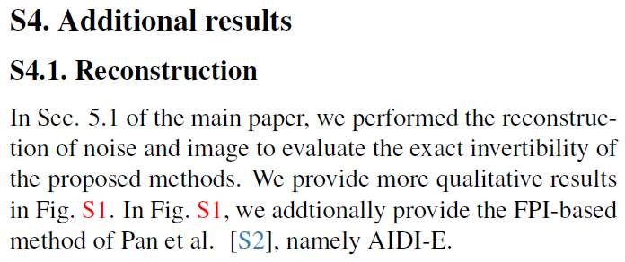

# CVPR supplementary material citation form changing bst file
I provide a .bst file which changes the citation form from [1] to [S1].
It is modified from ieeenat_fullname.bst.
So this can be used for supplementary materials for CVPR submission, and I hope so.

# Examples

  
  

