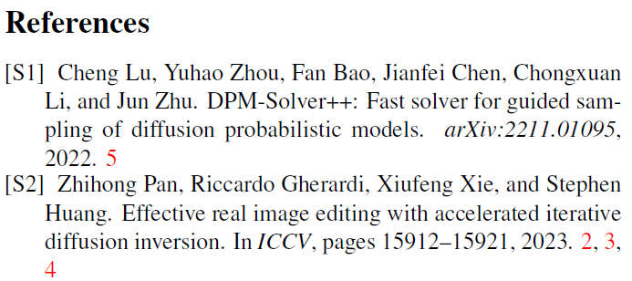

# CVPR Supplementary Material Citation Format (`.bst` File)

This repository provides a `.bst` [file](ieeenat_fullname_supp.bst) that modifies the citation format from `[1]` to `[S1]`. 

The file is based on `ieeenat_fullname.bst` and is tailored for supplementary materials in CVPR submissions.  

Feel free to use it for your CVPR supplementary material to meet the required citation format.

# How to use
1. Download [ieeenat_fullname_supp.bst](ieeenat_fullname_supp.bst)
2. add the following to your .tex file:
```
{
    \small
    \bibliographystyle{ieee_fullname_supp}
    \bibliography{refs}
}
```


# Examples
<div style="display: flex; align-items: flex-start;">
  
  
</div>

# About me
https://smhongok.github.io
